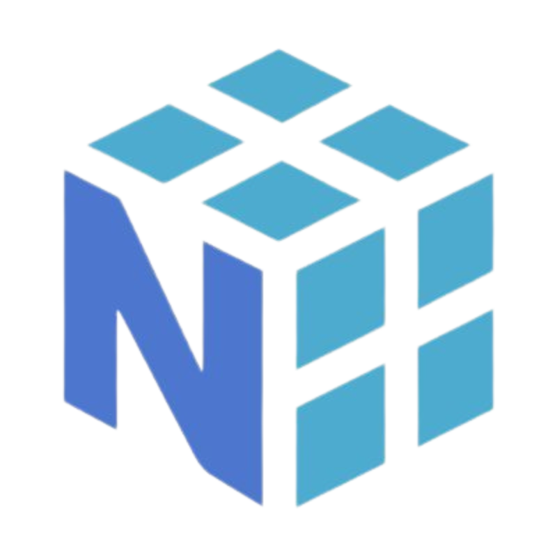
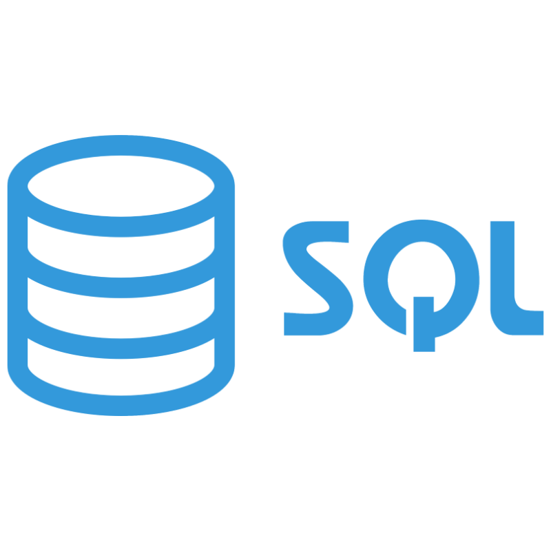

<h1 align="center">
  
  
  
</h1>

# Technologies ⚙
<h3 align="center">Web Development</h3>

  
  
  
  
  
  
  
  
  
  
  
  
  
  

<h3 align="center">Languages 👨‍💻</h3>

  
  
  
  
  
  
  
   
   
  

  <h3>Data Scientist 👨‍🔬 </h3>
  
  
DSA0013510081106

 
 

  
  
  
  
  
  
  
  

  <h3>Data Analyst 📊</h3>
  
  
DAA0015045663039

 
 

  
  
  
  
  
  
  
  
  
  

  <h3>Data Engineer 🔧</h3>
  
  
DEA0015920007286

 
 

  
  
  
  

# Stats 📈

  
  

